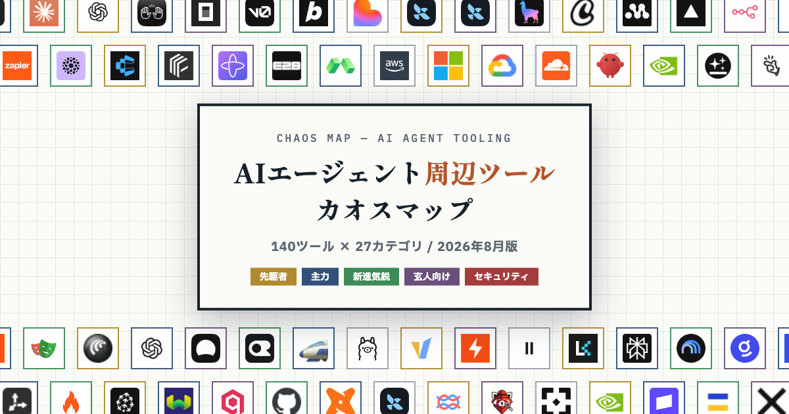

# AIエージェント周辺ツール カオスマップ 2026

AIエージェントを「つくる・つなぐ・うごかす・ささえる」ための周辺ツール140個を、27カテゴリに整理したインタラクティブなカオスマップです。

[日本語版を見る](https://rsasage.com/ai-agent-tools-chaos-map/ja/) / [View in English](https://rsasage.com/ai-agent-tools-chaos-map/)



## 特徴

- カテゴリをクリックして、勢力図・登場時期・ツール同士の関係を表示
- 各ツールの概要、特徴、公式サイトへのリンクを掲載
- 日本語と英語の2言語に対応
- フレームワーク、実行基盤、ブラウザ自動化、監視、セキュリティなどを横断して収録

## ローカルで見る

ビルドや依存パッケージのインストールは不要です。リポジトリのルートで静的ファイルサーバーを起動してください。

```sh
python3 -m http.server 8000
```

- English: <http://localhost:8000/>
- 日本語: <http://localhost:8000/ja/>

## ファイル構成

| パス | 内容 |
| --- | --- |
| `index.html` | 英語版ページ |
| `ja/index.html` | 日本語版ページ |
| `assets/app.js` | 共通の表示・操作ロジック |
| `assets/data-en.js` | 英語版のツールデータ |
| `assets/data-ja.js` | 日本語版のツールデータ |
| `assets/icons.js` | ツールアイコン |
| `assets/style.css` | 共通スタイル |

## 掲載範囲について

基盤モデル（GPT / Claude / Geminiなど）そのものは対象外です。分類や評価は2026年8月時点の独自見解です。

## Links

- [GitHub repository](https://github.com/Arahabica/ai-agent-tools-chaos-map)
- [VoiceApp Lab](https://voiceapp-lab.com/)
- [YouTube「ギリギリ開発会議」](https://www.youtube.com/@girigirikk)
